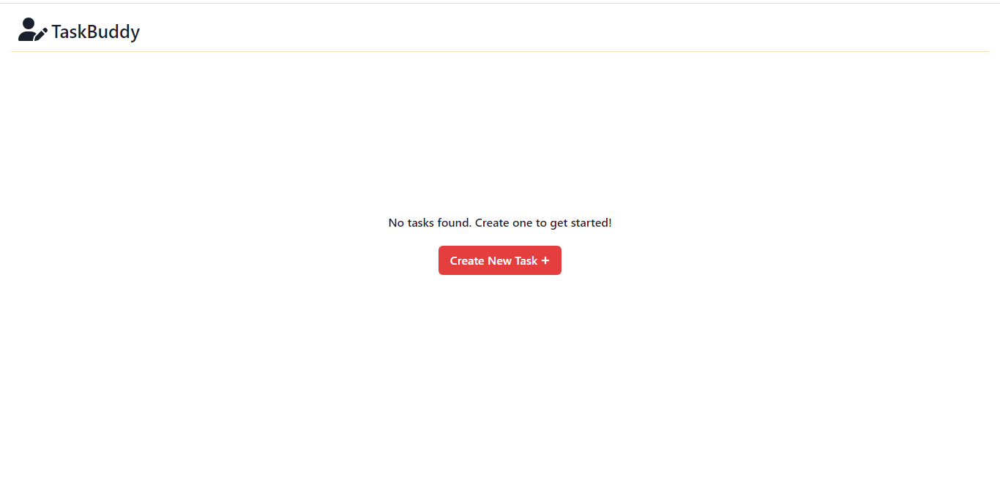
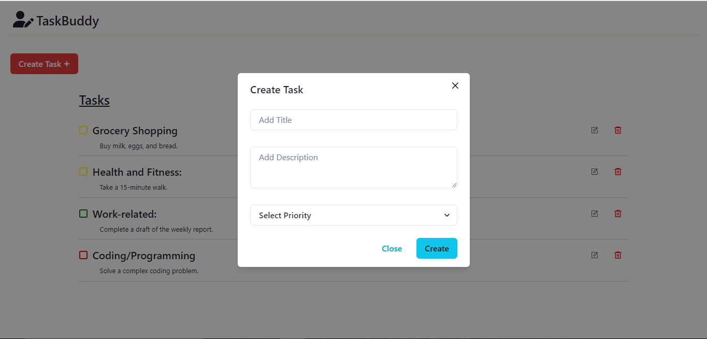
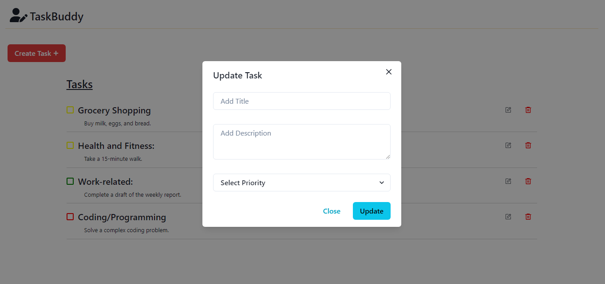
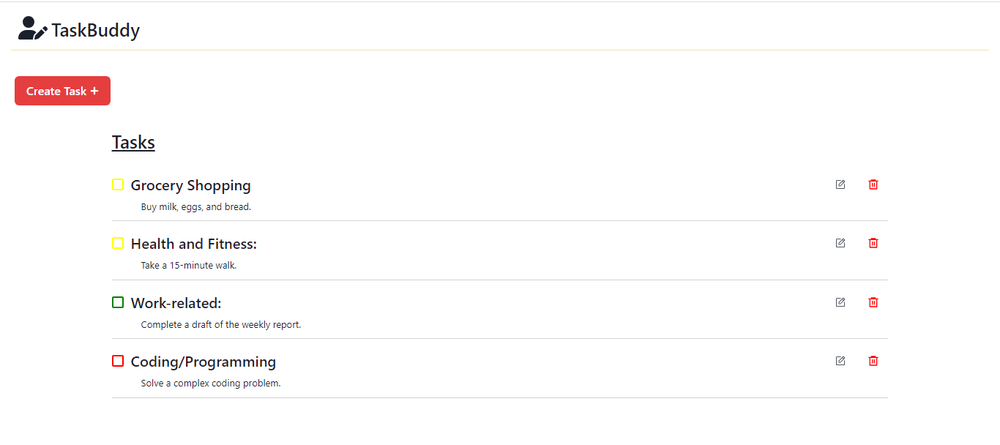
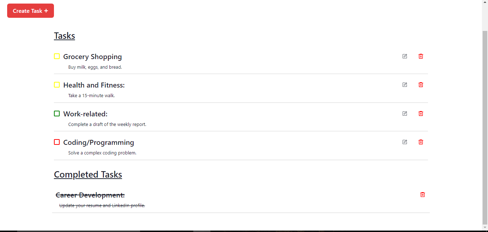

# TaskBuddy

A Task Management Application using React that allows users to add, edit, delete tasks, and mark tasks as completed.

Demo Link : https://task-buddy-self.vercel.app/

## ScreenShots







## How to deploy and run the service

<details>
<summary>Manually install with NPM and all...</summary>

First, clone the repo and go to root of repo

```bash
git clone https://github.com/jatinrathore/TaskBuddy.git
cd TaskBuddy
npm install
```

```bash
npm start
```

</details>

## Features Checklist

- [x] Users can add new Task by clicking on create button with the following information.

      - Title
      - Description
      - Priority(Low, Medium, Hard)

- [x] Users can update Task by clicking on second icon from right side of page.

- [x] Users can delete Task by clicking on first icon from right side of page.

- [x] Section of Completed Tasks with visual indication of strike through text.

- [x] Bonus Feature

  - Sorting based on Task's Priority.
  - Due Date for Task is added.

- [x] Extra Feature

  1. Different colors of Checkboxes based on Task's Priority.
     - Yellow color for low priority tasks.
     - Green color for medium priority tasks.
     - Red color for high priority tasks.

- [x] State Management is done by Context.
